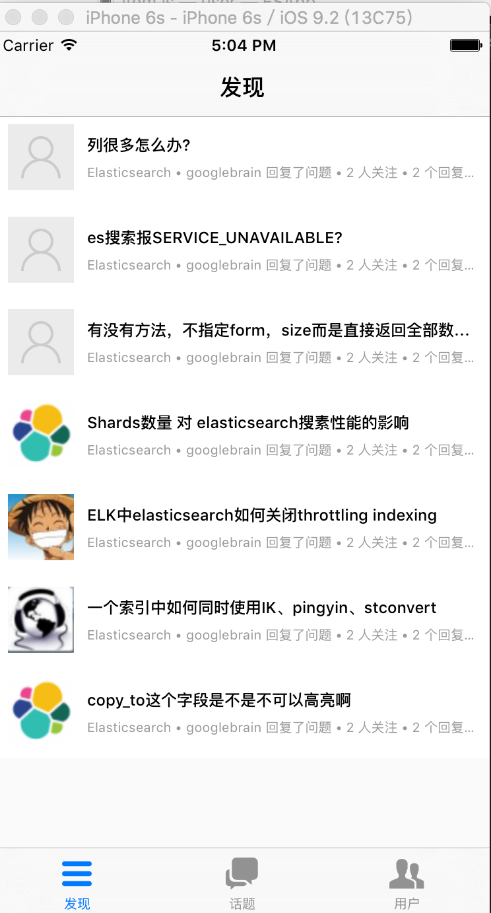
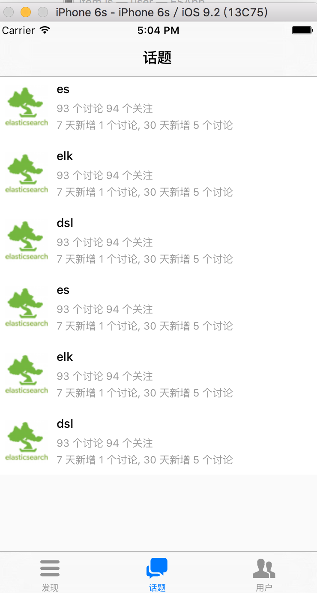
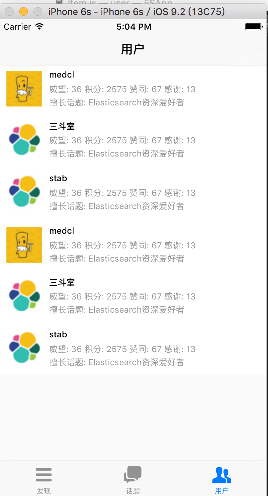

# ESApp
基于React-Native & react-rudex实现的一个小App，主要展示Elasticsearch中文社区的内容
主要方便大家在手机上看中文社区内容

##  主要功能   

+ 发现列表
+ 话题列表
+ 推荐用户列表 

## 主要技术
+ Recat Native && react-redux

## 效果如下图

## TODO

+ 后端获取数据&格式化前端需要的数据
+ 每一个列表的详情
+ 其他需要的需求
